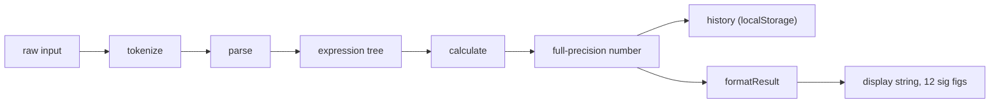

# Architecture

The technical brief: a guided tour of the six decisions that carry most of this codebase, each section stating the choice, the reasoning, and the trade-off accepted, with file paths throughout. The six: a language engine that is framework-free TypeScript with Vue as only the shell, a hand-rolled recursive-descent parser with explicit guardrails, a policy of rejecting what JavaScript would quietly accept, full-precision arithmetic with rounding applied only to the display, submit-time evaluation with a history that knows what it owns, and a deployment that is nothing but static assets on a Cloudflare Worker.

## The engine is framework-free TypeScript

[src/lib/evaluator.ts](src/lib/evaluator.ts) is the whole language: `tokenize`, `parse`, and `calculate`, composed into one exported `evaluate` pipeline, in about 160 lines with no Vue import. [src/lib/format.ts](src/lib/format.ts) is the only other file in `src/lib/`, and it handles display formatting alone. Everything Vue lives above that boundary: [src/App.vue](src/App.vue) mounts [src/components/StarCalculator.vue](src/components/StarCalculator.vue), which wires the composables in [src/composables/](src/composables) to the presentational components.

The reasoning: the interesting logic here is language processing, not UI, so it should be testable as plain functions. Both unit suites ([src/lib/evaluator.test.ts](src/lib/evaluator.test.ts), [src/lib/format.test.ts](src/lib/format.test.ts)) import the engine directly and run without a DOM, a component mount, or a mock.

The trade-off is that automated coverage stops at the engine boundary: the submit, blur, recall, and example flows in the composables are exercised manually, not by the test suite. Its known limit: a regression in the Vue layer would not fail `npm test`.

## A recursive-descent parser with explicit guardrails

The grammar is one line, `expression = number | "(" operator expression expression ")"`, so [parse](src/lib/evaluator.ts) is hand-rolled recursive descent: a `cursor` object shared by the recursive calls so they all advance the same position, a `parseExpression` / `parseOperand` pair, and a final check that nothing is left over after the one allowed expression. A parser generator or grammar library would be more machinery than language for six binary operators.

Three guardrails make the hand-rolled approach safe. Nesting depth is capped at 1000 (`MAX_DEPTH`), so a pathologically deep input fails with a clear message instead of a raw `RangeError`, and because the evaluator walks the tree with the same depth of recursion, the one cap protects both phases; the test suite proves it with a 100,000-level expression. `noUncheckedIndexedAccess` is on in [tsconfig.app.json](tsconfig.app.json), so every `tokens[i]` read types as possibly `undefined` and the end-of-input cases cannot be forgotten (turning the flag on surfaced real token-consumption bugs, commit `90add52`). And `computeOp`'s switch has no default case: it is exhaustive over the `Operator` union, so adding an operator to `OPERATORS` without handling it is a compile error, and the operator list quoted in error messages (`OPERATOR_LIST`) is derived from that same array so the two cannot drift.

The trade-off: a shared mutable cursor is less elegant than a pure functional parser that returns `[node, rest]`, but it keeps the code close to how you would trace it by hand, and a test pins down that `parse` never mutates the token array it is given.

## Reject what JavaScript would quietly accept

`Number()` happily parses `"0x10"`, `"0b10"`, `"0o10"`, and `"Infinity"`, and JavaScript arithmetic happily returns `Infinity` for division by zero and `NaN` for a negative base under a fractional exponent. This calculator refuses all of it. Operands must be plain decimal: a regex in `parseOperand` rejects hex, binary, and octal forms before `Number()` sees them, and a `Number.isFinite` check rejects `Infinity` as an operand. After every operation, `calculate` checks `Number.isFinite(result)`, so overflow like `(* 1e308 1e308)` and undefined results like `(^ -1 0.5)` throw instead of leaking sentinel values into the display and history. Division and modulo by zero throw their own named errors.

In the other direction the tokenizer is deliberately lenient: Lisp-style `;` line comments are stripped before tokenizing, because s-expressions come from the Lisp family and an example pasted with its annotation, like `(+ 1 2) ; Expected result: 3`, should still evaluate.

Error messages quote the offending token, like `Invalid number "foo"`, rather than reporting a character position. Inputs are short one-liners in a single field, so the quoted token is enough to find the problem, and the parser stays free of position bookkeeping. The trade-off of the whole policy: some inputs JavaScript could technically compute are refused, because a clear "no" beats a surprising number.

## Compute in full precision, round only the display

The engine returns raw IEEE-754 doubles, and history stores them unrounded. Only at the last moment does [src/lib/format.ts](src/lib/format.ts) round the displayed string to 12 significant figures, comfortably below the 15 to 17 digits where double representation noise begins, so `(+ 0.1 0.2)` shows `0.3` while the value underneath stays `0.30000000000000004`. Integers bypass `toPrecision` entirely, because rounding would corrupt a large exact integer like `123456789012345`; `parseFloat` then strips the padding zeros, extreme magnitudes fall back to exponential notation, and `String(-0)` conveniently renders negative zero as `0`.

The reasoning: rounding at the display layer, the way handheld and search-engine calculators do, means float noise never surfaces to the user, while rounding never contaminates stored values. In [src/composables/useCalculator.ts](src/composables/useCalculator.ts) the split is visible as `evaluation.result` (raw) versus the `displayResult` computed (formatted). The trade-off: two results that differ only past the 12th significant figure display identically, and the display is not always the exact value held in history.

## Evaluate on submit, and history that knows what it owns

Evaluation runs when the user submits, by Enter, the Calculate button, or clicking away, never on every keystroke. Per-keystroke validation flags an expression as wrong before the user has finished typing it, which is exactly what NN/g advises against, and it flickers the error message and layout on each character. The flows live in [src/composables/useCalculator.ts](src/composables/useCalculator.ts): blur commits like a submit, except when the box holds an untouched example. A clicked example evaluates inline (`runExample`) so a reviewer can click through every worked example and see its result, but an `exprFromExample` flag keeps a bare click-away from committing it to history; only an explicit submit, or a hand edit that reclaims the box, does that. Resubmitting the expression already at the top of history shows an "already saved" hint (auto-dismissed after 4 seconds) instead of stacking a duplicate.

[src/composables/useHistory.ts](src/composables/useHistory.ts) owns persistence: the last 8 entries in `localStorage` under `stor:history`, with a validating load that drops malformed or hand-edited entries instead of crashing, and a write wrapped in try/catch so a full or disabled storage just means history does not survive a reload. [src/composables/useDocsModal.ts](src/composables/useDocsModal.ts) isolates the docs modal's global side effects (body scroll lock, Escape-to-close) behind the same composable pattern, and the DOM concerns of the input, textarea autosize and focus, stay in [src/components/CalculatorInput.vue](src/components/CalculatorInput.vue) where the composable never touches them.

The trade-off of submit-time evaluation: while an expression is being edited, the result shown beside it is the previous submit's, stale until the next Enter, Calculate, or blur. That is accepted as the cost of a calm input.

## Static assets on a Cloudflare Worker

[wrangler.jsonc](wrangler.jsonc) is the entire deployment: serve `./dist` as static assets with `single-page-application` fallback. There is no server code, no bindings, no build step beyond Vite's. `npm run deploy` in [package.json](package.json) chains the production build and `npx wrangler deploy`.

The reasoning: everything in this app runs client-side, evaluation included, and history is `localStorage`, so hosting reduces to serving files, and a Worker with an assets directory does that with one config file. The trade-off is inherent to the choice: no server means no accounts and no shared history, so history is per-browser by design.
